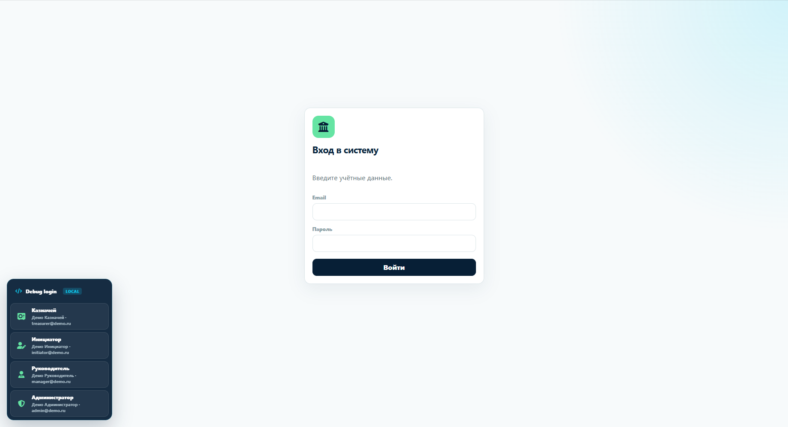
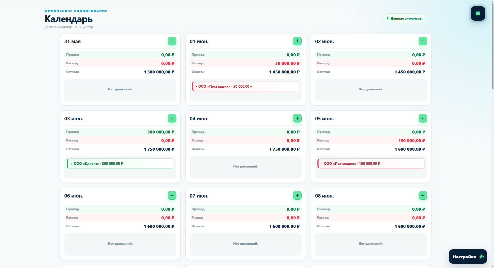
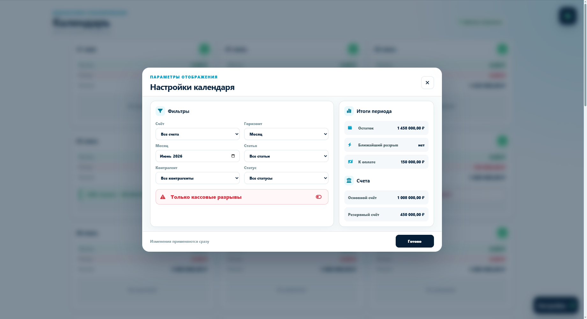
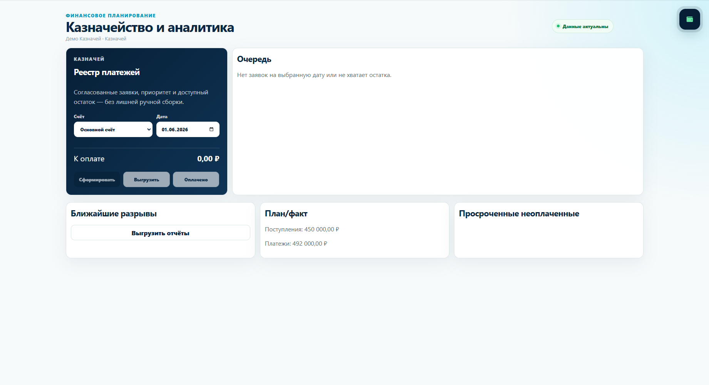
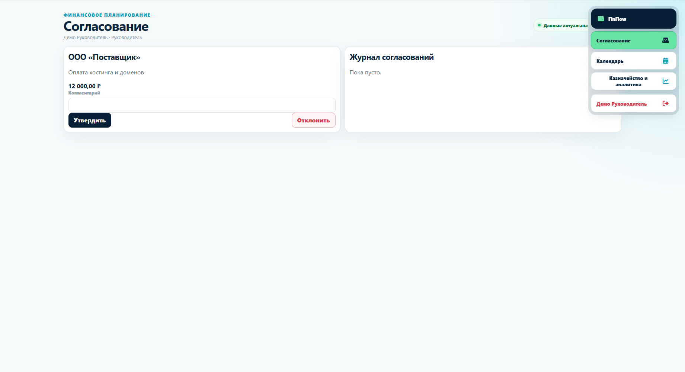
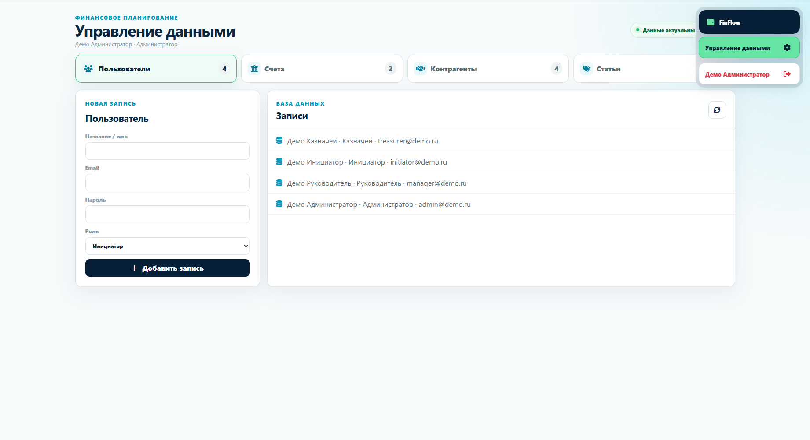
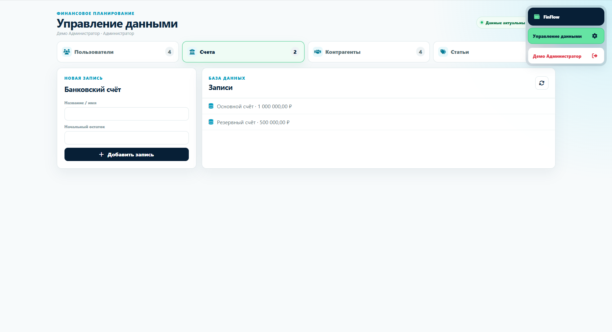
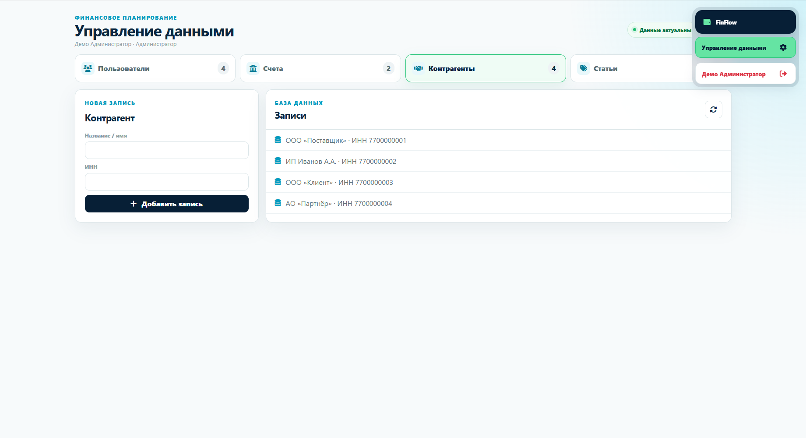
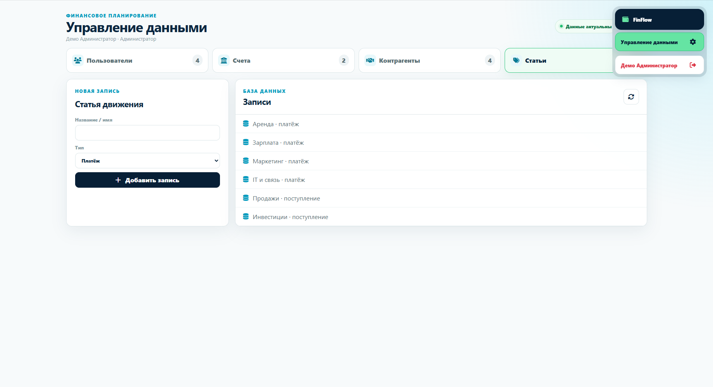

# Payment Calendar


## Preview

Live demo: https://mitfart.github.io/Practice_TrueMachine_2_Payment-Calendar/

## Gallery

<table>
<tr>
  <td></td>
  <td></td>
  <td></td>
</tr>
<tr>
  <td></td>
  <td></td>
  <td></td>
</tr>
<tr>
  <td></td>
  <td></td>
  <td></td>
</tr>
</table>
Payment planning application built with Laravel, React, TypeScript, PostgreSQL, and Docker.

## Recommended startup

Requirements:

- Docker Desktop
- Docker Compose

From the project root:

```powershell
docker compose up --build
```

Open:

```text
http://localhost:8080
```

Docker starts three services:

- React frontend with Nginx
- Laravel API
- PostgreSQL database

Database migrations and demonstration data are applied automatically.

## Demo accounts

The debug login menu is located in the bottom-left corner of the login page.
It contains one user for every role.

| Role | Email |
|---|---|
| Administrator | `admin@payment-calendar.local` |
| Manager | `manager@payment-calendar.local` |
| Treasurer | `treasurer@payment-calendar.local` |
| Initiator | `initiator@payment-calendar.local` |

Default password for every demo user:

```text
Chicken_Road_K10_28
```

All demonstration users and financial data belong to the `DEMO` company.
The administrator is created automatically and only one administrator is
allowed.

## Useful Docker commands

Start in the background:

```powershell
docker compose up --build -d
```

View service status:

```powershell
docker compose ps
```

View backend logs:

```powershell
docker compose logs backend --tail 100
```

Stop the application:

```powershell
docker compose down
```

Delete the database and start from a clean state:

```powershell
docker compose down -v
docker compose up --build
```

## Local frontend development

Requirements:

- Node.js 22+
- Backend running at `http://127.0.0.1:8000`

```powershell
cd frontend
npm install
npm run dev
```

Vite proxies `/api` requests to the local Laravel backend.

## Local backend development

Requirements:

- PHP 8.4+
- Composer
- PostgreSQL

```powershell
cd backend
Copy-Item .env.example .env
composer install
php artisan key:generate
php artisan migrate --seed
php artisan serve --host=127.0.0.1 --port=8000
```

Configure PostgreSQL credentials and `APP_DEBUG=true` in `backend/.env`
before running migrations.

## Verification

Frontend:

```powershell
cd frontend
npm run build
npm run lint
```

Backend:

```powershell
cd backend
php artisan test
```

## Project structure

- `backend/` — Laravel API, database migrations, and seed data
- `frontend/` — React and TypeScript client
- `docs/technical-specification.md` — product technical specification
- `docker-compose.yml` — complete Docker environment


